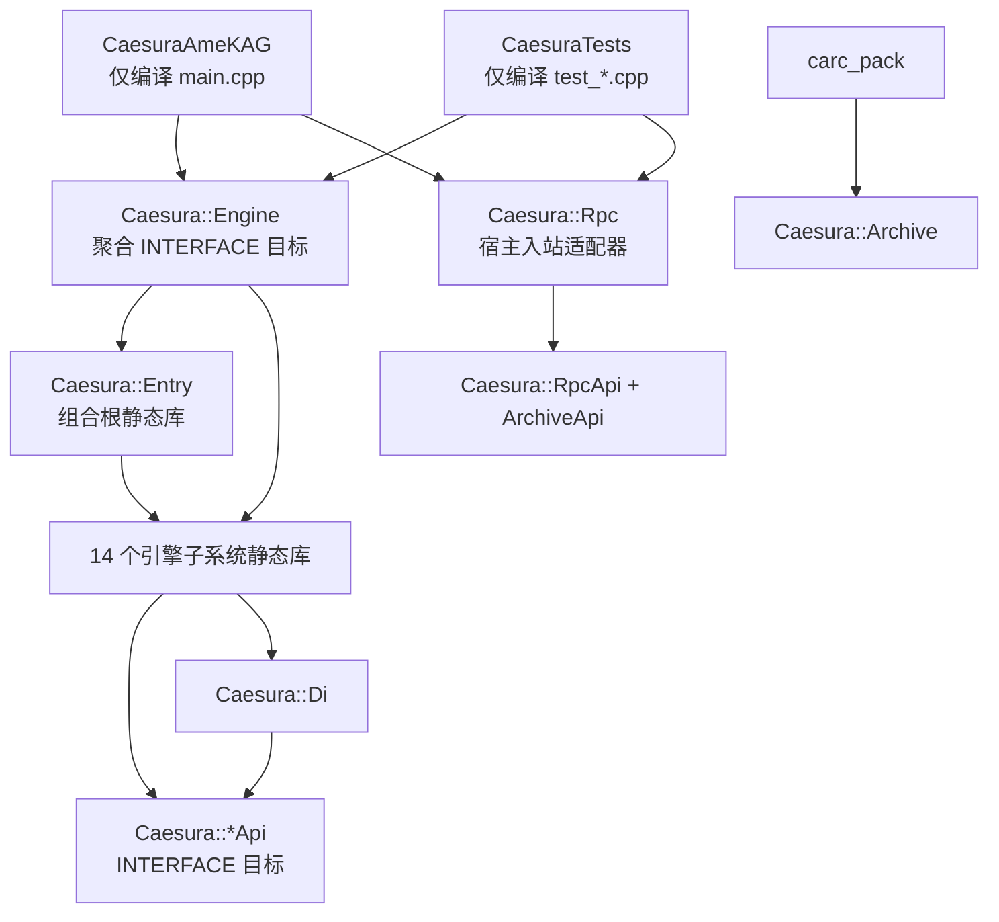

# 引擎架构与构建拓扑

## 架构决策

Caesura 采用“内部模块静态库 + 最终单一可执行文件”的混合结构：

- 15 个普通子系统与 `entry` 组合根分别形成静态库，共 16 个内部模块静态库。
- 除 `entry` 外，每个模块都有对应的 API-only `INTERFACE` 目标，共 15 个 API 目标。
- 每个子系统的生产源码只编译一次，便于约束依赖和复用测试。
- 对外交付仍是 `CaesuraAmeKAG` 单一可执行文件，不引入 DLL ABI、部署或版本兼容负担。
- 测试链接与正式程序相同的模块库，不再重复编译生产源码。
- `carc_pack` 直接复用归档模块，不维护第二套 CARC/Ed25519 源文件清单。

目标定义集中在 `cmake/CaesuraModules.cmake`。

## CMake 目标分层



除 `entry` 外的 15 个普通模块各有两个目标：

| 目标 | 类型 | 职责 |
|---|---|---|
| `Caesura::<Module>Api` | `INTERFACE` | 表达接口头、公共编译条件和接口级依赖 |
| `Caesura::<Module>` | `STATIC` | 只拥有该模块的生产 `.cpp`，链接实现所需依赖 |

`entry` 是组合根，没有单独的 API 目标。`Caesura::Engine` 不编译源码，只聚合
`entry` 与 14 个运行时引擎模块。`Caesura::Rpc` 由最终程序和测试显式链接，避免
入站传输层反向进入引擎核心。

## 模块源码归属

| 模块目标 | 源码目录 | 说明 |
|---|---|---|
| `Caesura::Archive` | `src/archive` | CARC、加密、签名、增量归档 |
| `Caesura::Audio` | `src/audio` | SoLoud 与空音频后端 |
| `Caesura::Debug` | `src/debug` | 日志、热重载、调试协议 |
| `Caesura::Di` | `src/di` | BackendRegistry、配额、线程断言状态 |
| `Caesura::Entry` | `src/entry` | Engine 生命周期与具体后端组合 |
| `Caesura::Input` | `src/input` | SDL 输入路由 |
| `Caesura::Job` | `src/job` | 多线程任务系统 |
| `Caesura::Live2D` | `src/live2d` | 空动画后端及可选 Cubism 实现 |
| `Caesura::MiniGame` | `src/minigame` | 3D 小游戏后端及其内嵌着色器 |
| `Caesura::Platform` | `src/platform` | SDL3/Null 平台后端与移动适配 |
| `Caesura::Render` | `src/render` | bgfx/Null 渲染、纹理、视频、粒子 |
| `Caesura::Resource` | `src/resource` | 资源提供者、解码、异步加载 |
| `Caesura::Rpc` | `src/rpc` | 编辑器 HTTP/RPC 服务 |
| `Caesura::Script` | `src/script` | Lua VM、状态与绑定；`SaveBinding` 归属本模块 |
| `Caesura::Steam` | `src/steam` | Steamworks 后端 |
| `Caesura::Storage` | `src/storage` | 存档、迁移、本地/云提供者 |

`src/render/EmbeddedShaders_SPIRV.cpp` 是唯一不单独进入目标的 `.cpp`；它由 `EmbeddedShaders.cpp` 文本包含，重复编译会产生重复定义。

## 组合根与运行时注册

`src/entry/Engine.cpp` 与其拆分实现文件负责具体后端的创建、生命周期编排和
`BackendRegistry` 注册。与脚本、粒子和存档相关的当前关系如下：

| 服务 | 生命周期/所有权 | 注册与访问 |
|---|---|---|
| `LuaManager` | `Engine` 以 `unique_ptr` 持有并负责初始化、关闭 | 初始化后以 `ILuaManager*` 注册，关闭时清空 |
| `HotReload` | `Engine` 以 `unique_ptr` 独占，且成员声明在 Lua 之后 | 不进入 Registry；初始化时借用当前 `lua_State*`，在 Lua 关闭前解绑 |
| `DebugProtocol` | `Engine` 按配置以 `unique_ptr` 持有，构造时借用所属 `HotReload&` | 不进入 Registry；HotReload 后挂载、Lua VM 前解绑；可 yield 协程通过非阻塞状态机暂停，传输只提交 DTO |
| `TextRenderer` / FreeType | `TextRenderer::TTFState` 懒初始化并独占 `FT_Library` 与 `FT_Face` | Render 模块内部 RAII；严格先释放 face 再释放 library，不再由 Engine 管理全局 context |
| `ParticleSystem` | `Engine` 以 `unique_ptr<IParticleSystem>` 持有 | 由组合根创建并注册；VFX 绑定只使用 `IParticleSystem` |
| `NullRenderDevice` / `NullPlatformBackend` | headless 模式下由 `Engine` 以接口 `unique_ptr` 持有 | 具体对象在组合根创建；Registry 只保存非拥有接口指针 |
| `GenerationTracker` | `Engine` 以 `unique_ptr<IResourceGenerationTracker>` 持有 | Script 只通过 Registry 和资源模块 API 失效句柄代际 |
| `TextureBudget` / `TextureManager` | `Engine` 分别以 `unique_ptr<ITextureBudget>`、`unique_ptr<ITextureManager>` 持有 | Render 只经 Registry 获取预算接口；关闭时释放资源并注销 |
| `JobSystem` / `AssetManager` / `AsyncLoader` | `Engine` 按依赖逆序析构要求持有三个实例 | AsyncLoader 接收非拥有 AssetManager 指针；组合根显式排空回调后依次关闭 Async、Asset、Job |
| `SaveManager` | `Engine` 以 `unique_ptr<ISaveManager>` 持有并初始化 | SaveBinding 只经 Registry 访问，关闭时清空注册 |
| `CryptoEngine` | `Engine` 以 `unique_ptr<ICryptoEngine>` 持有 | Archive/Storage 经 Registry 使用加密接口 |
| `SteamBackend` | `Engine` 以 `unique_ptr<ISteamBackend>` 持有；默认使用 Null adapter | 初始化成功后注册为 Registry 服务（当前共 22 个非拥有服务）；Steam Binding 每次从 Registry 解析，关闭时清空 |
| `LayerManager` | `Engine` 以 `unique_ptr<ILayerManager>` 持有；根据真实/Null renderer 选择 GPU 生命周期 | renderer 初始化后注册；shutdown 后立即注销 |
| `SandboxQuotaService` | `Engine` 以 `unique_ptr<ISandboxQuota>` 持有 | Lua 初始化后绑定 VM；音频/纹理释放配额后再解绑并注销 |

`RpcServer` 与 `EditorServer` 不属于 Engine 后端，由 `main.cpp` 以局部 RAII 对象持有。
两种传输都依赖 `IRpcDispatcher`，worker 只提交自包含 DTO 并等待回复；Engine owner
thread 在每帧最前排空队列。关闭时先停止 dispatcher intake 并完成等待者，再停止传输，
最后解绑 DebugProtocol、HotReload 和 Lua。`run` / `eval` 在 managed coroutine 完成前
明确返回 `unsupported_yieldable_execution`，不直接执行 Lua 主状态。

`DebugProtocol` 已用 `Running -> Paused -> ResumePending` 状态机取代 hook 内等待：
可 yield 协程在线 hook 中立即让出，线程安全 mailbox 按 `pauseId` 投递一条恢复命令，
跨暂停延迟命令会被拒绝，Lua owner thread pump 后由宿主显式恢复。暂停协程经 Lua
registry 强引用跨 GC 保活；不可 yield
命中只记录位置并继续执行。Engine 的 owner-thread pump 通过 managed resume 捕获错误并
清理 yielded/return 结果；恢复发生的同一帧禁止普通 Lua 回调。`kag_runner.lua` 的
`start/update/on_click` 统一经过 resume scheduler，并用只读 C 闭包实时查询暂停状态。
canonical source-id 已处理 Lua source 前缀、路径斜杠、绝对/相对路径、`.` / `..` 与
Windows ASCII 大小写；symlink/junction 解析及显式 source root 注入仍是后续增强项。

`EngineConfig` 是 move-only 的所有权转移包。调用方必须使用
`Engine engine(std::move(config))`；`enableDebugger` 随配置移动并控制协议挂载。构造完成后，原配置中的后端指针均为 `nullptr`，
具体对象由 `Engine` 的接口 `unique_ptr` 独占。

初始化失败会在 `init()` 内立即进入幂等回滚。关闭资源管线时保持以下顺序：

1. 停止 Layer、MiniGame 与异步生产者，不再创建新资源；
2. `AsyncLoader::shutdown()`、`AssetManager::shutdown()`、`JobSystem::shutdown()`；
3. Audio 与 TextureManager 释放仍追踪的资源及 Sandbox 配额；
4. 注销并解绑 `SandboxQuotaService` 与 `HotReload`，再关闭 Lua VM；
5. 按逆序关闭其余后端并清空 `BackendRegistry` 非拥有指针。

`SaveBinding.cpp/.h` 位于 `src/script/bindings/`，通过
`BackendRegistry::getSaveManager()` 获取 `ISaveManager`，不直接包含或访问具体
`SaveManager` 实现。

## 当前边界

当前迁移已完成模块源码唯一归属，并将 Script 对 Render、Storage 等子系统的
CMake 依赖收敛到对应 API 目标。Save 绑定经 `ISaveManager`、VFX 绑定经
`IParticleSystem`、Steam 绑定经 `ISteamBackend` 访问后端；RPC 也不再依赖 Script
实现库或 BackendRegistry。

MiniGame 着色器已归入 `src/minigame`，MiniGame 只链接 `RenderApi`；编辑器打包
通过宿主注入 `IArchiveWriter` 工厂，RPC 只依赖 `ArchiveApi`；TextureManager
经 Registry 的 `ITextureBudget` 获取预算。现存显式实现级跨模块链接主要是
`Render -> Debug`，用于 `AGENTS.md` 允许的零开销日志宏例外。

由于旧代码同时使用根路径和相对路径 include，公共构建选项暂时需要暴露 `src` 根目录。现阶段由 `AGENTS.md` 和 `scripts/count_coupling.py --ci` 约束接口边界；脚本同时检查模块耦合阈值和跨模块 `api/` include，CMake 本身仍不能阻止具体实现头被包含。

## 依赖方向

实现目标必须保持无环：

1. `BackendRegistry` 只依赖各模块的 `*Api` 目标。
2. 具体实现可以依赖 `Caesura::Di`，形成 `module implementation -> Di -> module API`，不会回到实现层。
3. `entry` 与 `main.cpp` 可以依赖具体实现，它们共同构成组合根。
4. 最终程序和测试通过 `Caesura::Engine` 获得核心目标图，并显式链接 `Caesura::Rpc`。

可选功能宏必须定义在真正编译实现的目标上，并在头文件布局受影响时传播给消费者：

| 宏 | 所属目标 | 传播方式 |
|---|---|---|
| `CAESURA_VIDEO_FFMPEG` | `Caesura::Render` | `PUBLIC` |
| `CAESURA_HAS_STEAM` | `Caesura::Steam`、`Caesura::Entry` | `PRIVATE` |
| `CAESURA_HAS_LIVE2D` | `Caesura::Live2D`、`Caesura::Entry` | `PRIVATE` |
| `CAESURA_DEBUG` | `Caesura::BuildOptions` | `INTERFACE` |

## 构建与验证

```powershell
cmake -S . -B build
cmake --build build --config Debug --parallel
build/tests/Debug/CaesuraTests.exe
ctest -C Debug --test-dir build --output-on-failure
python scripts/count_coupling.py --ci
```

Debug 构建会生成 `caesura_<module>.lib`、`CaesuraAmeKAG.exe`、`CaesuraTests.exe` 和 `carc_pack.exe`。模块库是内部架构边界，目前不作为稳定二进制 SDK 安装或发布。

当前全量门禁（round-88 审计基线）：C++ doctest `816/816` 用例（`6117` 断言）、
Lua 主套件 `124/124` + 孤儿套件 `18/18`、web `175/175`、editor `368/368`、
`ctest 10/10`（+AI smoke 跳过）、耦合 `PASS`。
