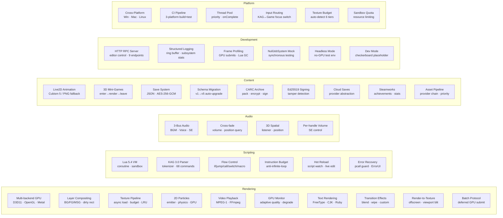

# Engine Capability Matrix (Mermaid)

## Capability Breakdown

### Rendering (10 capabilities)

| # | Capability | Interface | Status |
|---|-----------|-----------|--------|
| R1 | Multi-backend GPU (D3D11/OpenGL/Metal) | `IRenderDevice` | ✓ |
| R2 | 3-layer compositing (BG/FG/MSG) with dirty-rect optimisation | `ILayerManager` | ✓ |
| R3 | Async texture loading with budget enforcement + LRU eviction | `ITextureManager` | ✓ |
| R4 | 2D GPU particle system (emitters, physics, colour) | `IParticleSystem` | ✓ |
| R5 | Video playback (MPEG-1 via pl_mpeg, FFmpeg optional) | `IVideoPlayer` | ✓ |
| R6 | Adaptive GPU quality monitor with automatic degradation | `IGpuMonitor` | ✓ |
| R7 | Text rendering (FreeType atlas, CJK support, ruby/furigana) | `IRenderDevice` | ✓ |
| R8 | Transition effects (blend, wipe, custom shader) | `IRenderDevice` | ✓ |
| R9 | Render-to-texture with viewport blit | `IRenderDevice` | ✓ |
| R10 | Batch draw-call protocol for multi-layer scenes | `IRenderDevice` | ✓ |

### Scripting (6 capabilities)

| # | Capability | Interface | Status |
|---|-----------|-----------|--------|
| S1 | Lua 5.4 VM with coroutine-based scheduler | `ILuaManager` | ✓ |
| S2 | KAG 3.0 script parser (68 commands, 9 categories) | Lua tokenizer | ✓ |
| S3 | Flow control (if/else, jump/call/return, switch/case, macros) | Lua scheduler | ✓ |
| S4 | Instruction budget sandbox (anti-infinite-loop, per-frame cap) | `ILuaManager` | ✓ |
| S5 | Hot reload (watch scripts/, live-reload without restart) | HotReload singleton | ✓ |
| S6 | Error recovery (pcall guards, ErrorUI, graceful degradation) | scheduler + bindings | ✓ |

### Audio (4 capabilities)

| # | Capability | Interface | Status |
|---|-----------|-----------|--------|
| A1 | 3-bus audio (BGM with cross-fade, Voice with interrupt, SE) | `IAudioBackend` | ✓ |
| A2 | Fade, position query, per-bus volume control | `IAudioBackend` | ✓ |
| A3 | 3D spatial audio (listener position, 3D SE placement) | `IAudioBackend` | ✓ |
| A4 | Per-SE-handle volume and stop control | `IAudioBackend` | ✓ |

### Content Systems (9 capabilities)

| # | Capability | Interface | Status |
|---|-----------|-----------|--------|
| C1 | Live2D animation (Cubism 5 SDK / PNG static fallback) | `IAnimationBackend` | ✓ (SDK: deferred) |
| C2 | 3D mini-game framework (enter→update→render→leave loop) | `IMiniGameBackend` | Interface ✓, impl deferred |
| C3 | Encrypted save/load (JSON, AES-256-GCM) | `ISaveManager` | ✓ |
| C4 | Schema migration (v1→v5 auto-upgrade, pluggable migrations) | `ISaveManager` | ✓ |
| C5 | CARC archive packaging (compress, encrypt, sign) | `IArchiveWriter` | ✓ |
| C6 | Ed25519 digital signature (tamper detection for .carc files) | `ICryptoEngine` | ✓ |
| C7 | Cloud save provider abstraction (local / remote pluggable) | `ISaveProvider` | ✓ |
| C8 | Steamworks integration (achievements, stats, cloud saves) | `ISteamBackend` | Conditional compile |
| C9 | Asset provider chain (Dir → CARC, priority-ordered, integrity check) | `IAssetProvider` | ✓ |

### Development Tools (6 capabilities)

| # | Capability | Interface | Status |
|---|-----------|-----------|--------|
| D1 | HTTP editor server (9 endpoints: ping, status, assets, run, stop, logs, Live2D, build) | `IEditorServer` | ✓ |
| D2 | Structured logging (ring buffer, subsystem error counts, per-subsystem stats) | `IDebugManager` | ✓ |
| D3 | Frame profiling (GPU submit count, transient allocs, Lua GC timing) | `IDebugManager` | ✓ |
| D4 | NullJobSystem mock (synchronous task execution for deterministic testing) | `IJobSystem` | ✓ |
| D5 | Headless mode (no-GPU Engine init for CI/test environments) | `EngineConfig` | ✓ |
| D6 | Dev mode (checkerboard placeholder textures, verbose logging) | `ITextureManager` | ✓ |

### Platform Infrastructure (6 capabilities)

| # | Capability | Interface | Status |
|---|-----------|-----------|--------|
| P1 | Cross-platform (Windows MSVC, Linux GCC, macOS Clang) | `IPlatformBackend` | ✓ |
| P2 | CI pipeline (3-platform build + 324 tests, GitHub Actions) | `.github/workflows/ci.yml` | ✓ |
| P3 | Multi-threaded task system (priority queues, main-thread callbacks) | `IJobSystem` | ✓ |
| P4 | Input routing (KAG ↔ Game focus switch, resize callbacks) | `IInputRouter` | ✓ |
| P5 | Texture budget auto-detection (6 tiers, 128MB–4GB) | `ITextureBudget` | ✓ |
| P6 | Lua sandbox resource quotas (textures, emitters, handles) | `ISandboxQuota` | ✓ |

---

**Total: 41 capabilities across 6 domains. 35 complete, 4 interface-complete (impl deferred), 2 conditional.**