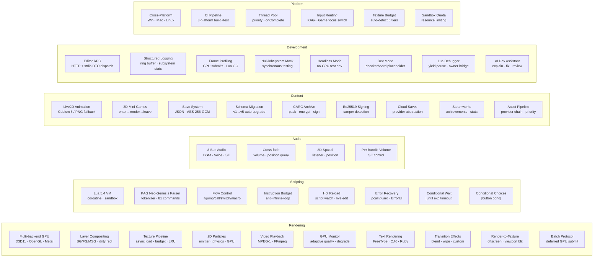

# Engine Capability Matrix (Mermaid)

> 2026-08-06 readiness audit (updated after GPU verification iteration): this matrix tracks 54 code-level capability surfaces.
> A present interface or conditional implementation is not counted as release validation.

## Readiness Snapshot

| Layer | Completion | Evidence boundary |
|---|---:|---|
| Modular architecture migration | 98% | Static/API targets, composition ownership, Engine-owned DebugProtocol, owner-thread RPC DTO dispatch, Lua-hook coexistence, shared production linkage and source-level gates are in place |
| Core visual-novel usability | 74% | Headless/KAG/save/audio unit paths strong; R7/R8/C2 verified on real GPU (D3D11 + OpenGL 4.3); mini-game Lua binding + demo end-to-end; remaining gap: Metal backend and macOS/Linux hardware validation |
| Cross-platform product release | 34% | Multi-platform CI builds exist; Windows D3D11+GL real-GPU pixels verified; optional SDKs (Steam/Live2D) and non-Windows packages not release-verified |

The percentages are deliberately conservative. Unit-test success demonstrates regression coverage,
not that optional SDKs, assets, drivers or editor transport have been exercised in production conditions.

```mermaid
graph LR
    subgraph "Rendering"
        r1["Multi-backend GPU<br/>D3D11 · OpenGL · Metal"]
        r2["Layer Compositing<br/>BG/FG/MSG · dirty rect"]
        r3["Texture Pipeline<br/>async load · budget · LRU"]
        r4["2D Particles<br/>emitter · physics · GPU"]
        r5["Video Playback<br/>MPEG-1 · FFmpeg"]
        r6["GPU Monitor<br/>adaptive quality · degrade"]
        r7["Text Rendering<br/>FreeType · CJK · Ruby"]
        r8["Transition Effects<br/>blend · wipe · custom"]
        r9["Render-to-Texture<br/>offscreen · viewport blit"]
        r10["Batch Protocol<br/>deferred GPU submit"]
    end

    subgraph "Scripting"
        s1["Lua 5.4 VM<br/>coroutine · sandbox"]
        s2["KAG Neo-Genesis Parser<br/>tokenizer · 81 commands"]
        s3["Flow Control<br/>if/jump/call/switch/macro"]
        s4["Instruction Budget<br/>anti-infinite-loop"]
        s5["Hot Reload<br/>script watch · live edit"]
        s6["Error Recovery<br/>pcall guard · ErrorUI"]
        s7["Conditional Wait<br/>[until exp timeout]"]
        s8["Conditional Choices<br/>[button cond]"]
    end

    subgraph "Audio"
        a1["3-Bus Audio<br/>BGM · Voice · SE"]
        a2["Cross-fade<br/>volume · position query"]
        a3["3D Spatial<br/>listener · position"]
        a4["Per-handle Volume<br/>SE control"]
    end

    subgraph "Content"
        c1["Live2D Animation<br/>Cubism 5 / PNG fallback"]
        c2["3D Mini-Games<br/>enter→render→leave"]
        c3["Save System<br/>JSON · AES-256-GCM"]
        c4["Schema Migration<br/>v1→v5 auto-upgrade"]
        c5["CARC Archive<br/>pack · encrypt · sign"]
        c6["Ed25519 Signing<br/>tamper detection"]
        c7["Cloud Saves<br/>provider abstraction"]
        c8["Steamworks<br/>achievements · stats"]
        c9["Asset Pipeline<br/>provider chain · priority"]
    end

    subgraph "Development"
        d1["Editor RPC<br/>HTTP + stdio DTO dispatch"]
        d2["Structured Logging<br/>ring buffer · subsystem stats"]
        d3["Frame Profiling<br/>GPU submits · Lua GC"]
        d4["NullJobSystem Mock<br/>synchronous testing"]
        d5["Headless Mode<br/>no-GPU test env"]
        d6["Dev Mode<br/>checkerboard placeholder"]
        d7["Lua Debugger<br/>yield pause · owner bridge"]
        d8["AI Dev Assistant<br/>explain · fix · review"]
    end

    subgraph "Platform"
        p1["Cross-Platform<br/>Win · Mac · Linux"]
        p2["CI Pipeline<br/>3-platform build+test"]
        p3["Thread Pool<br/>priority · onComplete"]
        p4["Input Routing<br/>KAG↔Game focus switch"]
        p5["Texture Budget<br/>auto-detect 6 tiers"]
        p6["Sandbox Quota<br/>resource limiting"]
    end
```

## Capability Breakdown

### Rendering (10 capabilities)

| # | Capability | Interface | Status |
|---|-----------|-----------|--------|
| R1 | Multi-backend GPU (D3D11/OpenGL/Metal) | `IRenderDevice` | ✓ D3D11 + OpenGL 4.3 real-GPU verified; Metal engine-side complete (embedded shaders, backend selection, Live2D Metal render path implemented) -- runtime validation requires macOS hardware |
| R2 | 3-layer compositing (BG/FG/MSG) with dirty-rect optimisation | `ILayerManager` | ✓ |
| R3 | Async texture loading with budget enforcement + LRU eviction | `ITextureManager` | ✓ |
| R4 | 2D GPU particle system (emitters, physics, colour) | `IParticleSystem` | ✓ |
| R5 | Video playback (MPEG-1 via pl_mpeg, FFmpeg optional) | `IVideoPlayer` | ✓ |
| R6 | Adaptive GPU quality monitor with automatic degradation | `IGpuMonitor` | ✓ |
| R7 | Text rendering (FreeType atlas, CJK support, ruby/furigana) | `IRenderDevice` | ✓ CJK font (NotoSansCJKsc, OFL) + `text_set_font` face switching; D3D11 GPU smoke test loads real OTF (786 glyphs), renders CJK + ruby; `loadTTF` guarded against uninitialized GPU + glyph-failure diagnostics |
| R8 | Transition effects (blend, wipe, custom shader) | `IRenderDevice` | ✓ blend/wipe/custom-shader paths; Transition program compiled on D3D11 + OpenGL 4.3, demo flash+crossfade rendered on both backends (2026-08-06) |
| R9 | Render-to-texture with viewport blit | `IRenderDevice` | ✓ |
| R10 | Batch draw-call protocol for multi-layer scenes | `IRenderDevice` | ✓ |

### Scripting (17 capabilities)

| # | Capability | Interface | Status |
|---|-----------|-----------|--------|
| S1 | Lua 5.4 VM with coroutine-based scheduler | `ILuaManager` | ✓ |
| S2 | KAG Neo-Genesis parser (81 contract commands, 9 categories) | Lua tokenizer | ✓ |
| S2a | KAG3 bare positional args (13 families, 15 commands: delay/wait/se/voice/play/jump/call/link/unlock/macro/erasemacro/save/load/gallery/ending) | tokenizer + scheduler | ✓ |
| S2d | KAG3 expression compatibility (TJS `&& \|\| ! != ?:` translated string-aware; visible scene:line errors instead of silent else) | `kag/expr.lua` | ✓ |
| S2e | KAG3 variable system (`%f.x%` interpolation, `lf` call-frame stack, `mp` message params, dual-style expression env) | schema + scheduler | ✓ |
| S2f | KAG3 control-flow completeness (`[elsif]` alias, `[call *label]` intra-scene, `[end]`→ending, unknown-tag warnings) | tokenizer + scheduler | ✓ |
| S2g | Modern utility commands (`[set]` typed, `[inc]`, `[random]`, `[assert]`) | system commands | ✓ |
| S2h | Command metadata (category/blocking/desc on all 61 contracts; emitted by schema_doc + dumpContracts) | schema | ✓ |
| S2b | Exact token offsets (byte-accurate '[' position + end_offset via dual Cp) | `parse_with_offsets` | ✓ |
| S2c | Parser performance (4000 tokens 362ms -> 259ms, 64.75ms/1000tok after dropping 9 redundant prefix patterns) | lpeg.lua | ✓ |
| S2i | KAG scene-level debugger (breakpoints on scene+cmd/line, single-step, scope inspection; RPC kagSetBreakpoint/kagDebugContinue/kagDebugStep/kagInspectScopes) | `kag_debug.lua` + scheduler + RPC | ✓ |
| S2j | Mod loader (scene/resource override by priority; mods/<name>/<path> wins over base; path-traversal guarded) | `mods.lua` + flow + resolve_file | ✓ |
| S2k | Input recording/playback (auto-demo + regression; [replay] command, JSON persistence, choice coordinates) | `replay.lua` + kag_runner | ✓ |
| S2l | Accessibility (closed captions for voiced lines, settings toggle, TTS interface probe) | text commands + settings | ✓ |
| S2m | Scene hot reload (edit a running .ks -> re-parse + position remap + state preserved; HotReload watches assets/script + mods; RPC kagReloadScene) | `kag_runner.reload_scene` + HotReload + flow | ✓ |
| S2n | LLM-driven dialogue ([ai_dialog] async query; OpenAI-compatible / Ollama endpoints; graceful fallback text; AI binding + sandbox whitelist) | `AIBinding` + system commands + backend | ✓ |
| S2o | Demo/video export (recorded replay drives the game while each frame is captured to PNG; --export-replay/--export-dir; screenshot readback fixed) | `Engine::run` + `BgfxDebugCallback::screenShot` | ✓ |
| S2p | Colorblind/high-contrast filter (config.accessibility.color_filter presets; VFX effect 4 matrix pass over RTT scene layers; D3D11 + GL shaders) | `IRenderDevice::setColorFilter` + fs_vfx effect 4 | ✓ (RTT scene layers; direct-drawn UI text unaffected) |
| S2q | Declarative conditional wait (`[until exp="..." timeout=ms]` — wait until a TJS expression is truthy; per-frame yield + cancellation; Ren'Py needs python loops for this) | scheduler + compiler (AOT exp/dump) | ✓ |
| S2r | Conditional choices (`[button cond="f.x > 1"]` — false choices hidden at [endbutton]; Ren'Py menu `if` parity; all-hidden blocks dissolve) | `kag/commands/text.lua` + `kag/expr.lua` | ✓ |
| S2s | Inline text markup (`{color=#rrggbb}` per-span colors, `{size=N}` glyph scaling affecting wrap, `{b}` synthetic bold, `{i}` italic top-edge shear, `{s}` strikethrough middle bar — all stackable; unknown `{tags}` literal) | `kag/text_layout.lua` (parse_markup/wrap_spans) + `kag/text_scene.lua` (add_wrapped_spans) + `IRenderDevice::renderText(scale, bold, italic, strike)` | ✓ (34 Lua assertions; typewriter reveal + backlog use stripped plain text; strike bar geometry headless-tested) |
| S2t | NVL mode (`[nvl]` full-screen accumulated text block, Ren'Py parity; `[nvl clear]`/`[p]` page break, `[nvl off]` exit; speaker as 「Name」： inline prefix styled by `nameplate_style.text_color` — format customizable via `[nvl prefix="%s："]` schema param (persists per session, `%`-safe); wraps with the line, instant draw — zero new state fields; cursor reused from text_state so save/rollback persists the page) | `kag/commands/text.lua` (`nvl` handler + ch/text/p/er accumulation) + `kag/text_scene.lua` (`commit` seals prior reveal draws, `instant` draws skip typewriter) + save/snapshot `nvl_mode` | ✓ (29 Lua assertions; typewriter only animates the appended line) |
| S2u | Localization pipeline (`{key}` token expansion with markup-name whitelist + per-line translation `lines["<scene>:<fnv1a(msg)>"]`, content-addressed keys; applied by [ch]/[text] before markup parsing **and by [button]/[sel] choice labels at registration**; empty placeholder falls back to original; settings Language hot-switch + save persistence; `scripts/ks_i18n.lua` template generator with --update merge, extracts dialogue + choice labels) | `scripts/i18n.lua` (fnv1a/localize/expand/load) + `kag/commands/text.lua` (ch/text/button localize) + `assets/lang/{zh,en,ja}.lua` | ✓ (37 Lua assertions; generated ja.lua template with 25 demo keys incl. choice labels) |
| S3 | Flow control (if/else, jump/call/return, switch/case, macros) | Lua scheduler | ✓ |
| S7 | Declarative command contracts (typed params, clamping, $var/${expr} interpolation, required/choices) | `kag/schema.lua` | ✓ |
| S8 | Static .ks validator + contract audit gate (ks_check --audit-defaults, CI) | `scripts/ks_check.lua` | ✓ |
| S8a | Truncation detection (offset stream stops before end-of-input + trailing comment handling) | ks_check | ✓ |
| S9 | Parameterized macros (args + %arg% substitution, nested expansion, deep-copied splice) | Lua scheduler | ✓ |
| S10 | Label index (O(1) jump, scene-scoped, restored/invalidated on swap) | Lua scheduler | ✓ |
| S11 | [if] expr cache keyed by env identity (no stale variables across scenes) | Lua scheduler | ✓ |
| S4 | Instruction budget sandbox (anti-infinite-loop, per-frame cap) | `ILuaManager` | ✓ (preserved through DebugProtocol attach/detach, breakpoint yield/resume and inherited coroutine hooks) |
| S5 | Hot reload (watch scripts/, live-reload without restart) | Engine-owned `HotReload` instance | ✓ |
| S6 | Error recovery (pcall guards, ErrorUI, graceful degradation) | scheduler + bindings | ✓ |
| S6a | Modal UI input loops (settings/music_room/gallery/chapter select -- per-frame yield + GAME key routing: UP/DOWN/LEFT/RIGHT/ENTER/ESC/F/mouse) | ui modules + Engine input | ✓ |
| S6b | UI state persistence (settings values, favorites, unlock sets, visual text state) | settings/music_room/save | ✓ |

### Audio (4 capabilities)

| # | Capability | Interface | Status |
|---|-----------|-----------|--------|
| A1 | 3-bus audio (BGM with cross-fade, Voice with interrupt, SE) | `IAudioBackend` | ✓ |
| A2 | Fade, position query, per-bus volume control | `IAudioBackend` | ✓ |
| A3 | 3D spatial audio (listener position, 3D SE placement) | `IAudioBackend` | ✓ |
| A4 | Per-SE-handle volume and stop control | `IAudioBackend` | ✓ |

### Content Systems (9 capabilities)

| # | Capability | Interface | Status |
|---|-----------|-----------|--------|
| C1 | Live2D animation (Cubism 5 SDK / PNG static fallback) | `IAnimationBackend` | Partial: PNG fallback + D3D11 (Windows) verified; **Metal render path fully implemented (was stub); GL shader deployment fixed (active-renderer FrameworkShaders copy)** -- GL/Metal runtime validation needs Linux/macOS hardware. SDK is bundled in thirdparty/. See `docs/guides/live2d-setup.md` |
| C2 | 3D mini-game framework (enter→update→render→leave loop) | `IMiniGameBackend` | ✓ lifecycle + JSON scenes + 20-API Lua binding (`mini_game` global, sandbox-whitelisted); real-GPU D3D11 child-process test (enter→update→render→leave) + programmatic `enter(0)` mode; demo_minigame.lua runs end-to-end on D3D11 and OpenGL 4.3 |
| C3 | Encrypted save/load (JSON, AES-256-GCM) | `ISaveManager` | ✓ |
| C4 | Schema migration (v1→v5 auto-upgrade, pluggable migrations) | `ISaveManager` | ✓ |
| C5 | CARC archive packaging (compress, encrypt, sign) | `IArchiveWriter` | ✓ |
| C6 | Ed25519 digital signature (tamper detection for .carc files) | `ICryptoEngine` | ✓ |
| C7 | Cloud save provider abstraction (local / remote pluggable) | `ISaveProvider` | ✓ abstraction + local path + **HTTP cloud provider (push/pull/delete against a REST endpoint, offline degrade) + Lua save.configure_cloud/cloud_push/cloud_pull; mock-server round trip tested** |
| C8 | Steamworks integration (achievements, stats, cloud saves) | `ISteamBackend` | Conditional (needs Steam SDK/account): full Lua surface (19 APIs incl. cloud list/write/read/delete/quota), overlay/stats/store fixes, Null-backend tested; real SDK round trip needs a Steam dev account |
| C9 | Asset provider chain (Dir → CARC, priority-ordered, integrity check) | `IAssetProvider` | ✓ |

### Development Tools (7 capabilities)

| # | Capability | Interface | Status |
|---|-----------|-----------|--------|
| D1 | Editor RPC (HTTP plus stdio JSON-RPC) | `IEditorServer`, `IRpcServer`, `IRpcDispatcher` | Full: both transports use owner-thread DTO dispatch and are CLI-wired; managed-coroutine `run/eval` + breakpoint lifecycle (set/remove/clear/continue) + inspect + frame capture implemented on both transports; stdio smoke (`headless_rpc_smoke.py`) and HTTP smoke (`headless_http_smoke.py`, 14 assertions) end-to-end tested via ctest |
| D2 | Structured logging (ring buffer, subsystem error counts, per-subsystem stats) | `IDebugManager` | ✓ |
| D3 | Frame profiling (GPU submit count, transient allocs, Lua GC timing) | `IDebugManager` | ✓ |
| D4 | NullJobSystem mock (synchronous task execution for deterministic testing) | `IJobSystem` | ✓ |
| D5 | Headless mode (no-GPU Engine init for CI/test environments) | `EngineConfig` | ✓ |
| D6 | Dev mode (checkerboard placeholder textures, verbose logging) | `ITextureManager` | ✓ |
| D7 | Lua debugger (breakpoints, step control, inspection) | `DebugProtocol` | ✓ Engine lifecycle, KAG resume arbitration, stdio commands, stale pause rejection and managed result/error cleanup are tested |
| D8 | AI dev assistant (`kag/aidev.lua`: local rule-based diagnostic explainer + structural scene review [flow balance / missing [end]]; LLM-enriched explanations, fix suggestions, full scene generation with self-review; exposed to the IDE via /api/eval) | `kag/aidev.lua` + `backend.ai_query` + AiPanel Dev Assist section | ✓ (26 Lua assertions; local paths work offline, LLM degrades gracefully) |
| D9 | LSP navigation (goto-definition / find-all-references for `*label` ↔ `[jump]`/`[call]`/`[link]`; cross-scene targets return name-only) | `kag/lsp.lua` (definition/references) + Monaco providers | ✓ (12 Lua assertions; Ctrl+Click + context menu in IDE) |
| D10 | Skeletal mesh animation (SMA S2/S3: CPU soft-skinning math + bgfx renderer + Lua driver [JSON/hierarchy/LERP] + `[sma_play]`/`[sma_stop]` contracts + `sma.*` binding) | `IMeshRenderer` + `SmaMeshRenderer` + `SmaSkinner` + `kag/sma.lua` + `SmaBinding` | ✓ (8 C++ + 25 Lua assertions; GPU deferred pattern; headless uses Null backend) |

### Platform Infrastructure (7 capabilities)

| # | Capability | Interface | Status |
|---|-----------|-----------|--------|
| P1 | Cross-platform (Windows MSVC, Linux GCC, macOS Clang) | `IPlatformBackend` | Partial: CI build coverage; real GPU behavior is not verified on all platforms |
| P2 | CI pipeline (3-platform build + doctest suite, GitHub Actions) | `.github/workflows/ci.yml` | ✓ (current local suite: 617 cases / 3002 asserts, Lua 116 files, 2026-08-12) |
| P3 | Multi-threaded task system (priority queues, main-thread callbacks) | `IJobSystem` | ✓ |
| P4 | Input routing (KAG ↔ Game focus switch, resize callbacks) | `IInputRouter` | ✓ |
| P5 | Texture budget auto-detection (6 tiers, 128MB–4GB) | `ITextureBudget` | ✓ |
| P6 | Lua sandbox resource quotas (textures, emitters, handles) | `ISandboxQuota` | ✓ |
| P7 | MobileAdapter (lifecycle callbacks, touch → mouse/wheel event mapping, DPI scaling) | `IMobileAdapter` (platform) | ✓ core mapping + lifecycle + **SDL finger events bridged (normalized -> pixel) + orientation change events (Lua _G.onOrientationChanged); 87 unit tests**; native mobile SDK integration still needs a device |

---

**Total: 61 tracked capabilities across 6 domains.** See the readiness snapshot above for
the distinction between architecture completion, core usability and release readiness.

### 2026-08-12 additions (generation-gap round 9)

- S2t — NVL mode `[nvl]`/`[nvl clear]`/`[nvl off]`: full-screen accumulated
  text (Ren'Py NVL parity) with page-break cursor reuse and save/rollback
  persistence of the page.
- S2 — command set census refreshed to 81 contracts (nvl + sma_play/sma_stop).

### 2026-08-12 additions (generation-gap round 6)

- S2s — inline text markup `{color=#rrggbb}`…`{/color}` (Ren'Py `{...}` parity;
  b/i/size consumed for source compat; unknown tags literal).
- D9 — LSP navigation: goto-definition / find-all-references for labels.
- D10 — Skeletal mesh animation S2/S3 (CPU soft-skinning + bgfx renderer + Lua
  driver + commands + binding).

### 2026-08-12 additions (generation-gap round 5)

- S2q `[until exp=... timeout=...]` — declarative conditional wait (AOT-compiled
  expression, per-frame yield, Operation cancellation, timeout guard).
- S2r `[button cond=...]` — conditional choices at [endbutton] (Ren'Py menu `if`
  parity; TJS conditions evaluated per block; all-hidden blocks dissolve).
- D8 `kag/aidev.lua` — AI-assisted development: local rule-based diagnostic
  explainer, structural scene review, LLM fix suggestions + scene generation
  with self-review; IDE surface via /api/eval (AiPanel Dev Assist section).

### Performance notes (2026-08-07 pass)

- Tokenizer: 4000-token scene parses in ~205 ms (52 ms/1000tok) after the
  -28.5% prefix-pattern pass; scene cache avoids re-parsing.
- Scheduler: 4001 coroutine resumes in ~16 ms (-36%): schema require
  hoisted out of the per-token loop; schema.coerce builds its location
  string lazily (error paths only).
- ks_check.lineOf: line-start index + binary search replaces per-token
  O(n) text scanning (O(n²) -> O(n log n)) — editor keystroke latency.
- expr.translate: bounded compiled-chunk cache (per-env identity).

### Module hardening pass (2026-08-07, per-module sweep)

- audio: 4-slot voice pool (overlapping lines fade, not cut) + BGM
  ducking (35% while a voice plays, exact restore); wave-cache LRU
  UB fixed (flushWaveCache rebuilt the LRU index; eviction guards)
- steam: overlay state via GameOverlayActivated_t (was IsOverlayEnabled
  -> permanent input pause); stats loaded via RequestCurrentStats +
  UserStatsReceived_t; StoreStats batched (1s throttle)
- input/entry: SDL_EVENT_WINDOW_RESIZED routed through
  InputRouter::notifyResize (was documented but never wired); per-frame
  GPU-time globals only written on change; single instruction-budget
  reset per frame
- archive: thread-local BCrypt key-handle cache (algorithm + key object
  reused across blocks; move-semantic RAII); save JSON compact (-40%)
- debug/job: LogEntry fixed char[256] (zero alloc per log call);
  isWorkerThread O(1) thread_local (was O(n) scan); dead member removed
- script/debug: RenderBinding getters cache backend pointers (registry
  lookup per binding call removed); DebugProtocol line hook fast path
  when no breakpoints/step
- render: fillViewport solid-pixel texture cached per color (was a GPU
  texture create per call); dead SimBatch worker + shouldUsePlmpeg
  removed
- minigame: sweep-and-prune collision detection (O(n^2) -> O(n log n))
- resource: decoded-asset cache (instant scene re-entry, cancelAll
  clears); ImageDecoder stb-first order fixed a 1x1-PNG crash in
  bimg::imageParse; dead cancel-generation field removed
