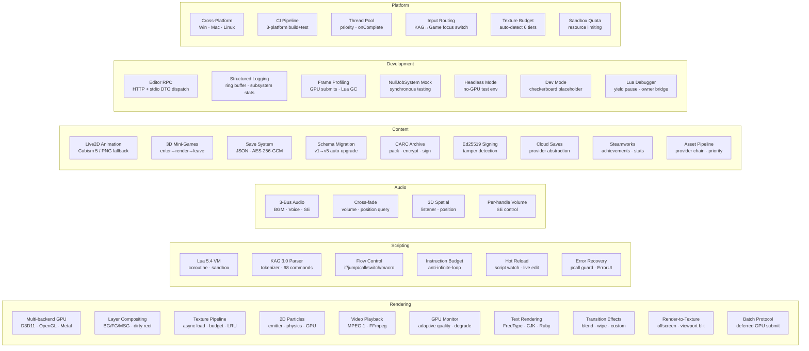

# Engine Capability Matrix (Mermaid)

> 2026-07-24 readiness audit: this matrix tracks 42 code-level capability surfaces.
> A present interface or conditional implementation is not counted as release validation.

## Readiness Snapshot

| Layer | Completion | Evidence boundary |
|---|---:|---|
| Modular architecture migration | 98% | Static/API targets, composition ownership, Engine-owned DebugProtocol, owner-thread RPC DTO dispatch, Lua-hook coexistence, shared production linkage and source-level gates are in place |
| Core visual-novel usability | 62% | Headless/KAG/save/audio unit paths are strong; real GPU, font assets and end-to-end interaction remain incomplete |
| Cross-platform product release | 30% | Multi-platform CI builds exist, but real GPU pixels, optional SDKs and non-Windows packages are not release-verified |

The percentages are deliberately conservative. Unit-test success demonstrates regression coverage,
not that optional SDKs, assets, drivers or editor transport have been exercised in production conditions.

```mermaid
graph LR
    subgraph "Rendering"
        r1["Multi-backend GPU<br/>D3D11 · OpenGL · Metal"]
        r2["Layer Compositing<br/>BG/FG/MSG · dirty rect"]
        r3["Texture Pipeline<br/>async load · budget · LRU"]
        r4["2D Particles<br/>emitter · physics · GPU"]
        r5["Video Playback<br/>MPEG-1 · FFmpeg"]
        r6["GPU Monitor<br/>adaptive quality · degrade"]
        r7["Text Rendering<br/>FreeType · CJK · Ruby"]
        r8["Transition Effects<br/>blend · wipe · custom"]
        r9["Render-to-Texture<br/>offscreen · viewport blit"]
        r10["Batch Protocol<br/>deferred GPU submit"]
    end

    subgraph "Scripting"
        s1["Lua 5.4 VM<br/>coroutine · sandbox"]
        s2["KAG 3.0 Parser<br/>tokenizer · 68 commands"]
        s3["Flow Control<br/>if/jump/call/switch/macro"]
        s4["Instruction Budget<br/>anti-infinite-loop"]
        s5["Hot Reload<br/>script watch · live edit"]
        s6["Error Recovery<br/>pcall guard · ErrorUI"]
    end

    subgraph "Audio"
        a1["3-Bus Audio<br/>BGM · Voice · SE"]
        a2["Cross-fade<br/>volume · position query"]
        a3["3D Spatial<br/>listener · position"]
        a4["Per-handle Volume<br/>SE control"]
    end

    subgraph "Content"
        c1["Live2D Animation<br/>Cubism 5 / PNG fallback"]
        c2["3D Mini-Games<br/>enter→render→leave"]
        c3["Save System<br/>JSON · AES-256-GCM"]
        c4["Schema Migration<br/>v1→v5 auto-upgrade"]
        c5["CARC Archive<br/>pack · encrypt · sign"]
        c6["Ed25519 Signing<br/>tamper detection"]
        c7["Cloud Saves<br/>provider abstraction"]
        c8["Steamworks<br/>achievements · stats"]
        c9["Asset Pipeline<br/>provider chain · priority"]
    end

    subgraph "Development"
        d1["Editor RPC<br/>HTTP + stdio DTO dispatch"]
        d2["Structured Logging<br/>ring buffer · subsystem stats"]
        d3["Frame Profiling<br/>GPU submits · Lua GC"]
        d4["NullJobSystem Mock<br/>synchronous testing"]
        d5["Headless Mode<br/>no-GPU test env"]
        d6["Dev Mode<br/>checkerboard placeholder"]
        d7["Lua Debugger<br/>yield pause · owner bridge"]
    end

    subgraph "Platform"
        p1["Cross-Platform<br/>Win · Mac · Linux"]
        p2["CI Pipeline<br/>3-platform build+test"]
        p3["Thread Pool<br/>priority · onComplete"]
        p4["Input Routing<br/>KAG↔Game focus switch"]
        p5["Texture Budget<br/>auto-detect 6 tiers"]
        p6["Sandbox Quota<br/>resource limiting"]
    end
```

## Capability Breakdown

### Rendering (10 capabilities)

| # | Capability | Interface | Status |
|---|-----------|-----------|--------|
| R1 | Multi-backend GPU (D3D11/OpenGL/Metal) | `IRenderDevice` | Partial: Windows path covered; GL/Metal shader/runtime validation incomplete |
| R2 | 3-layer compositing (BG/FG/MSG) with dirty-rect optimisation | `ILayerManager` | ✓ |
| R3 | Async texture loading with budget enforcement + LRU eviction | `ITextureManager` | ✓ |
| R4 | 2D GPU particle system (emitters, physics, colour) | `IParticleSystem` | ✓ |
| R5 | Video playback (MPEG-1 via pl_mpeg, FFmpeg optional) | `IVideoPlayer` | ✓ |
| R6 | Adaptive GPU quality monitor with automatic degradation | `IGpuMonitor` | ✓ |
| R7 | Text rendering (FreeType atlas, CJK support, ruby/furigana) | `IRenderDevice` | Partial: no distributable CJK font; font switching still incomplete |
| R8 | Transition effects (blend, wipe, custom shader) | `IRenderDevice` | Partial: non-D3D shader coverage is incomplete |
| R9 | Render-to-texture with viewport blit | `IRenderDevice` | ✓ |
| R10 | Batch draw-call protocol for multi-layer scenes | `IRenderDevice` | ✓ |

### Scripting (6 capabilities)

| # | Capability | Interface | Status |
|---|-----------|-----------|--------|
| S1 | Lua 5.4 VM with coroutine-based scheduler | `ILuaManager` | ✓ |
| S2 | KAG 3.0 script parser (68 commands, 9 categories) | Lua tokenizer | ✓ |
| S3 | Flow control (if/else, jump/call/return, switch/case, macros) | Lua scheduler | ✓ |
| S4 | Instruction budget sandbox (anti-infinite-loop, per-frame cap) | `ILuaManager` | ✓ (preserved through DebugProtocol attach/detach, breakpoint yield/resume and inherited coroutine hooks) |
| S5 | Hot reload (watch scripts/, live-reload without restart) | Engine-owned `HotReload` instance | ✓ |
| S6 | Error recovery (pcall guards, ErrorUI, graceful degradation) | scheduler + bindings | ✓ |

### Audio (4 capabilities)

| # | Capability | Interface | Status |
|---|-----------|-----------|--------|
| A1 | 3-bus audio (BGM with cross-fade, Voice with interrupt, SE) | `IAudioBackend` | ✓ |
| A2 | Fade, position query, per-bus volume control | `IAudioBackend` | ✓ |
| A3 | 3D spatial audio (listener position, 3D SE placement) | `IAudioBackend` | ✓ |
| A4 | Per-SE-handle volume and stop control | `IAudioBackend` | ✓ |

### Content Systems (9 capabilities)

| # | Capability | Interface | Status |
|---|-----------|-----------|--------|
| C1 | Live2D animation (Cubism 5 SDK / PNG static fallback) | `IAnimationBackend` | Partial: PNG fallback tested; Cubism is optional and Metal is a stub |
| C2 | 3D mini-game framework (enter→update→render→leave loop) | `IMiniGameBackend` | Skeleton: lifecycle exists; scene loading is not implemented |
| C3 | Encrypted save/load (JSON, AES-256-GCM) | `ISaveManager` | ✓ |
| C4 | Schema migration (v1→v5 auto-upgrade, pluggable migrations) | `ISaveManager` | ✓ |
| C5 | CARC archive packaging (compress, encrypt, sign) | `IArchiveWriter` | ✓ |
| C6 | Ed25519 digital signature (tamper detection for .carc files) | `ICryptoEngine` | ✓ |
| C7 | Cloud save provider abstraction (local / remote pluggable) | `ISaveProvider` | Partial: provider abstraction/local path; remote provider not release-verified |
| C8 | Steamworks integration (achievements, stats, cloud saves) | `ISteamBackend` | Conditional: SDK disabled by default; Null backend tested |
| C9 | Asset provider chain (Dir → CARC, priority-ordered, integrity check) | `IAssetProvider` | ✓ |

### Development Tools (7 capabilities)

| # | Capability | Interface | Status |
|---|-----------|-----------|--------|
| D1 | Editor RPC (HTTP plus stdio JSON-RPC) | `IEditorServer`, `IRpcServer`, `IRpcDispatcher` | Partial: both transports use owner-thread DTO dispatch and are CLI-wired; managed-coroutine `run/eval` and HTTP debug routes remain |
| D2 | Structured logging (ring buffer, subsystem error counts, per-subsystem stats) | `IDebugManager` | ✓ |
| D3 | Frame profiling (GPU submit count, transient allocs, Lua GC timing) | `IDebugManager` | ✓ |
| D4 | NullJobSystem mock (synchronous task execution for deterministic testing) | `IJobSystem` | ✓ |
| D5 | Headless mode (no-GPU Engine init for CI/test environments) | `EngineConfig` | ✓ |
| D6 | Dev mode (checkerboard placeholder textures, verbose logging) | `ITextureManager` | ✓ |
| D7 | Lua debugger (breakpoints, step control, inspection) | `DebugProtocol` | ✓ Engine lifecycle, KAG resume arbitration, stdio commands, stale pause rejection and managed result/error cleanup are tested |

### Platform Infrastructure (6 capabilities)

| # | Capability | Interface | Status |
|---|-----------|-----------|--------|
| P1 | Cross-platform (Windows MSVC, Linux GCC, macOS Clang) | `IPlatformBackend` | Partial: CI build coverage; real GPU behavior is not verified on all platforms |
| P2 | CI pipeline (3-platform build + doctest suite, GitHub Actions) | `.github/workflows/ci.yml` | ✓ (current local suite: 480 cases) |
| P3 | Multi-threaded task system (priority queues, main-thread callbacks) | `IJobSystem` | ✓ |
| P4 | Input routing (KAG ↔ Game focus switch, resize callbacks) | `IInputRouter` | ✓ |
| P5 | Texture budget auto-detection (6 tiers, 128MB–4GB) | `ITextureBudget` | ✓ |
| P6 | Lua sandbox resource quotas (textures, emitters, handles) | `ISandboxQuota` | ✓ |

---

**Total: 42 tracked capabilities across 6 domains.** See the readiness snapshot above for
the distinction between architecture completion, core usability and release readiness.
