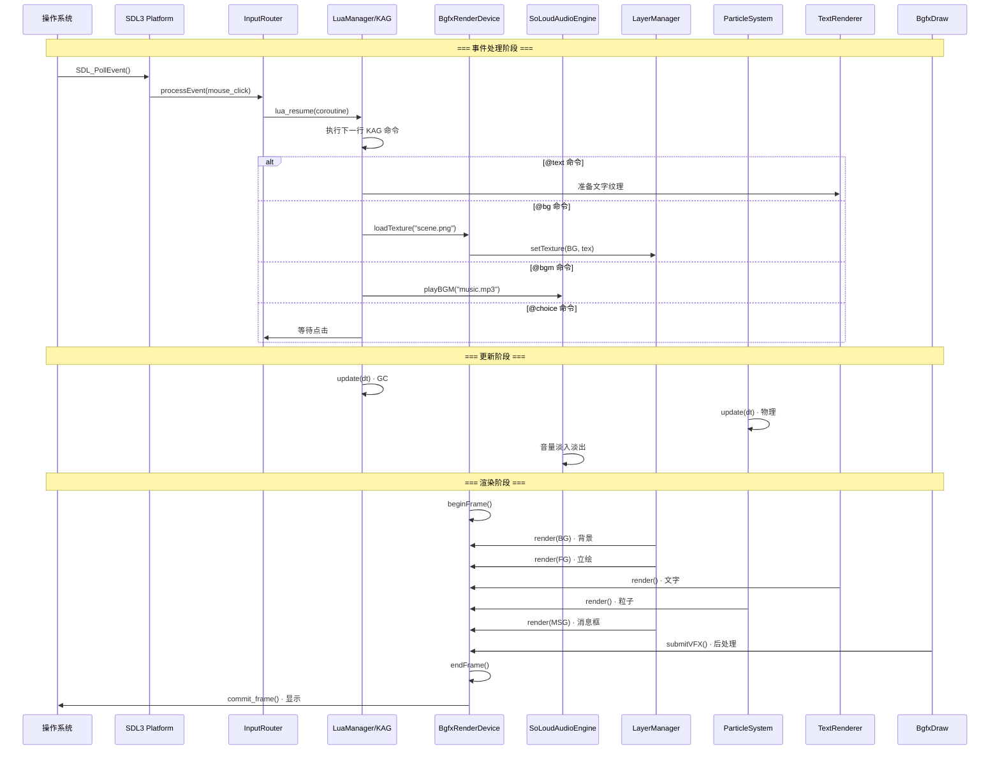
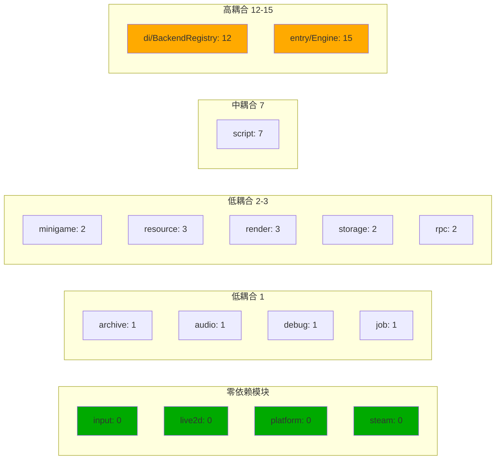

# Caesura (AmeKAG) 引擎 Mermaid 拓扑图

## 模块依赖拓扑

```mermaid
graph TB
    subgraph "组合根"
        MAIN["main.cpp<br/>创建所有后端实例"]
        ENTRY["entry/Engine<br/>组合根 · 4阶段初始化"]
    end

    subgraph "依赖注入层"
        DI["di/BackendRegistry<br/>26个 I* 接口指针<br/>ISandboxQuota<br/>ITextureBudget"]
    end

    subgraph "核心运行时"
        PLATFORM["platform<br/>SDL3PlatformBackend<br/>IPlatformBackend<br/>窗口/事件轮询"]
        INPUT["input<br/>InputRouter<br/>IInputRouter<br/>KAG/GAME 模式切换"]
        SCRIPT["script<br/>LuaManager + KAG引擎<br/>ILuaManager<br/>84 KAG命令 · 7 绑定"]
        RENDER["render<br/>bgfx 渲染管线<br/>IRenderDevice · ITextureManager<br/>IParticleSystem · ILayerManager<br/>IVideoPlayer · IGpuMonitor<br/>22 cpp"]
        AUDIO["audio<br/>SoLoudAudioEngine<br/>IAudioBackend<br/>BGM/SE/Voice"]
        RESOURCE["resource<br/>AssetManager · AsyncLoader<br/>IAssetProvider · IAsyncLoader<br/>stb_image 解码"]
        STORAGE["storage<br/>SaveManager<br/>ISaveManager · ISaveProvider<br/>JSON 存档 · AES 加密"]
    end

    subgraph "数据与归档"
        ARCHIVE["archive<br/>CARCReader/CARCWriter<br/>IArchiveReader · IArchiveWriter<br/>ICryptoEngine<br/>AES-256-GCM + zstd + Ed25519"]
    end

    subgraph "可选子系统"
        LIVE2D["live2d<br/>Live2DBackend<br/>IAnimationBackend<br/>PNG降级/Cubism SDK"]
        MINIGAME["minigame<br/>BgfxMiniGameBackend<br/>IMiniGameBackend<br/>3D几何/碰撞"]
        STEAM["steam<br/>SteamBackend<br/>ISteamBackend<br/>成就/云存档"]
    end

    subgraph "工具与诊断"
        DEBUG["debug<br/>DebugManager<br/>IDebugManager<br/>日志/性能/热重载"]
        JOB["job<br/>JobSystem<br/>IJobSystem<br/>多线程任务"]
        RPC["rpc<br/>EditorServer<br/>IRpcServer · IEditorServer<br/>HTTP :9876"]
    end

    MAIN -->|EngineConfig| ENTRY
    ENTRY -->|注册所有后端| DI

    DI -.->|I*| PLATFORM
    DI -.->|I*| INPUT
    DI -.->|I*| SCRIPT
    DI -.->|I*| RENDER
    DI -.->|I*| AUDIO
    DI -.->|I*| RESOURCE
    DI -.->|I*| STORAGE
    DI -.->|I*| ARCHIVE
    DI -.->|I*| LIVE2D
    DI -.->|I*| MINIGAME
    DI -.->|I*| STEAM
    DI -.->|I*| DEBUG
    DI -.->|I*| JOB
    DI -.->|I*| RPC

    PLATFORM -->|SDL_Event| INPUT
    INPUT -->|resume coroutine| SCRIPT
    SCRIPT -->|@text/@bg/@choice| RENDER
    SCRIPT -->|@bgm/@se| AUDIO
    SCRIPT -->|@save/@load| STORAGE
    RENDER -->|纹理查询| RESOURCE
    RESOURCE -->|读取归档| ARCHIVE
    STORAGE -->|加密| ARCHIVE
    JOB -->|异步解码| RESOURCE
    JOB -->|粒子并行| RENDER
    DEBUG -->|热重载| SCRIPT
    RPC -->|执行脚本| SCRIPT
    RPC -->|查询状态| DI
```

## 一帧完整数据流



## KAG 脚本执行流程

```mermaid
flowchart LR
    subgraph "磁盘"
        KS["demo_story.ks<br/>KAG 脚本文件"]
    end

    subgraph "Lua 层"
        TOK["tokenizer.lua<br/>词法分析"]
        PAR["parser.lua<br/>语法分析 → AST"]
        CON["conductor.lua<br/>协程调度执行"]
    end

    subgraph "C++ 绑定层"
        KAG["KAGBinding.cpp<br/>@text @bg @bgm @choice..."]
        REN["RenderBinding.cpp<br/>纹理/图层操作"]
        VFX["VFXBinding.cpp<br/>粒子系统"]
        DBG["DebugBinding.cpp<br/>日志/诊断"]
        DEV["DevCoreBinding.cpp<br/>引擎控制"]
        STEAM["SteamBinding.cpp<br/>Steam API"]
        SAVE["SaveBinding.cpp<br/>存档/读档"]
    end

    subgraph "引擎后端"
        BACKEND["BackendRegistry<br/>26 个 I* 接口"]
    end

    KS -->|require| TOK
    TOK -->|tokens| PAR
    PAR -->|AST| CON
    CON -->|@text| KAG
    CON -->|纹理操作| REN
    CON -->|粒子效果| VFX
    KAG --> BACKEND
    REN --> BACKEND
    VFX --> BACKEND
    DBG --> BACKEND
    DEV --> BACKEND
    STEAM --> BACKEND
    SAVE --> BACKEND
```

## 模块耦合热力图


