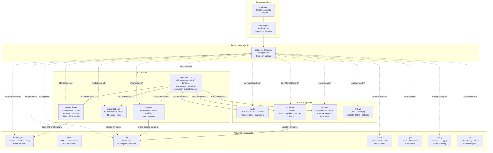

# Engine Architecture Topology (Mermaid)



## Module Descriptions

### Composition Root (entry/)
- **entry/Engine.cpp** — The only place that creates concrete backend objects.
- Four-phase init: `initPlatformPhase()` → `initScriptingPhase()` → `initAssetPhase()` → `initOptionalPhase()`.
- Registers all backends into `BackendRegistry` for the rest of the engine to access.

### Dependency Injection (di/)
- **BackendRegistry** — Singleton storing 26 non-owning `I*` pointers. All subsystem access goes through `::instance().get*()`.
- **TextureBudget** — Auto-detects 6 memory tiers (128MB–4GB), LRU eviction on overflow.
- **SandboxQuota** — Resource counting for Lua sandbox (textures, emitters, handles).

### Runtime Core
- **render** (22 .cpp, 6 interfaces) — bgfx-based GPU rendering. IRenderDevice for draw calls, ILayerManager for BG/FG/MSG compositing with dirty-rect optimization, ITextureManager for async texture lifecycle with budget enforcement, IParticleSystem for 2D GPU particles, IGpuMonitor for adaptive quality, IVideoPlayer for MPEG-1/FFmpeg playback.
- **script** (9 .cpp, 1 interface) — Lua 5.4 VM with instruction-budget sandbox. KAG tokenizer and scheduler (coroutine-based). 7 Lua binding modules (Render, VFX, KAG, Debug, DevCore, Save, Steam).
- **audio** (2 .cpp, 1 interface) — SoLoud 3-bus audio. BGM (cross-fade), Voice (interrupt), SE (2D/3D spatial). Per-bus volume, playback position query.
- **resource** (6 .cpp, 2 interfaces) — Async asset loading pipeline. IAssetProvider chain (Dir → CARC, priority-ordered). Worker-thread image decode (bimg + stb fallback).

### Content Systems
- **live2d** (6 .cpp, 1 interface) — Animation backend abstraction. Live2DBackend (requires Cubism 5 SDK) or NullAnimationBackend (PNG/JPG static sprite fallback).
- **minigame** (4 .cpp, 1 interface) — 3D mini-game framework. Enter/update/render/leave lifecycle. update() safe for worker threads, render() main-thread only. Lua bridge.
- **storage** (4 .cpp, 2 interfaces) — JSON save/load with AES-256-GCM encryption. Schema migration (v1–v5). ISaveProvider abstraction (local filesystem / cloud).
- **archive** (6 .cpp, 3 interfaces) — CARC archive format. AES-256-GCM encryption + Ed25519 signing. Reader/writer with key management.

### Platform & Infrastructure
- **platform** (2 .cpp, 1 interface) — SDL3 window, event polling, native handles for bgfx.
- **input** (1 .cpp, 1 interface) — SDL event router with KAG/Game focus switching.
- **job** (1 .cpp, 1 interface) — Multi-threaded task system. submit() with priority + onComplete callback. NullJobSystem mock for synchronous testing.
- **steam** (1 .cpp, 1 interface) — Steamworks achievements, stats, cloud saves. Conditional compile.
- **rpc** (2 .cpp, 2 interfaces) — HTTP editor server (9 endpoints: ping, status, assets, run, stop, logs, Live2D models/load, build). CORS enabled.
- **debug** (3 .cpp, 1 interface) — Structured logging (ring buffer), frame profiling, subsystem stats, GPU submit tracking.

## Game Frame Data Flow

```
SDL3 pollEvent() → InputRouter → KAG callback
  → Lua coroutine resume
  → scheduler.run() processes tokens
  → KAG commands dispatch to C++ bindings
  → BackendRegistry.get*() → concrete backend calls

Per frame:
  1. platform::pollEvent()    → input routing
  2. job::pollMainThreadJobs() → collect async results
  3. script::update(dt)       → resume Lua coroutine
  4. audio::update(dt)       → SoLoud tick
  5. debug::endFrameProfile() → record GPU submits
  6. render::beginFrame() → LayerManager::render() → endFrame() → commit_frame()
```