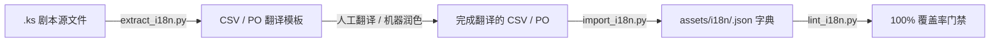

# Caesura (AmeKAG) — 创作者工具链与本地化指南

> 本指南介绍 Caesura 引擎为视觉小说创作者提供的自动化辅助工具：**剧本大纲可视化流向图 (Story Flow Graph)** 与 **自动化多语言提取与编译工作流 (i18n Pipeline)**。

---

## 1. 剧本大纲流向图生成器 (`generate_story_flow.py`)

### 1.1 用途
静态扫描任何 `.ks` 剧本或整个项目目录，提取剧本中的所有跳转标签（`*label`）、玩家选择分支（`[select]` / `[sel]`）、无条件跳转（`[jump]`）、子程序调用（`[call]` / `[return]`）以及结局标志（`[ending]`），自动生成：
- **Mermaid 流程图**（可在 Markdown 或支持 Mermaid 的编辑器中直接可视化渲染）
- **拓扑结构 JSON**（供编辑器大纲树节点解析）
- **静态跳转完整性诊断**（自动捕获指向不存在标签的断链错误与孤儿死分支）

### 1.2 使用方法

```bash
# 生成单个剧本或项目所有剧本的 Mermaid 流向图
python scripts/generate_story_flow.py demo/example_game/ --format mermaid

# 执行静态分支诊断（检测 broken jumps / unreachable labels）
python scripts/generate_story_flow.py demo/example_game/ --lint

# 导出为独立 Markdown 文档
python scripts/generate_story_flow.py demo/example_game/ -o docs/design/story_flow.md
```

---

## 2. 自动化多语言本地化流水线 (i18n Pipeline)

### 2.1 架构与生命周期



### 2.2 提取翻译字符串 (`extract_i18n.py`)
自动从对话（`[ch text="..."]`）、选择项（`[sel text="..."]`）、旁白与通知（`[notify msg="..."]`）中提取待翻译文本：

```bash
# 导出为 Excel/CSV 表格（适合译者直接在表格软件中编辑）
python scripts/extract_i18n.py demo/example_game/ --out tmp/game_strings.csv --format csv

# 导出为 GNU gettext PO 模板（适合 Poedit / Crowdin / Weblate 专业本地化平台）
python scripts/extract_i18n.py demo/example_game/ --out tmp/game_strings.po --format po --lang zh
```

### 2.3 导入与编译运行时字典 (`import_i18n.py`)
将填好翻译的 CSV 或 PO 一键转换为引擎运行时所需的 JSON 字典：

```bash
# 从 CSV 编译出 zh.json, en.json, ja.json
python scripts/import_i18n.py tmp/game_strings.csv --out-dir assets/i18n/
```

### 2.4 翻译完整性检查 (`lint_i18n.py`)
自动审计所有语言版本的覆盖率，发现漏翻、空行或缺失键：

```bash
python scripts/lint_i18n.py --dir assets/i18n/ --langs zh en ja
```

---

## 3. 游戏内多语言热切换 (`[i18n]`)

在 KAG 剧本中，只需使用 `[i18n]` 命令即可瞬时热切换语言，无需重新加载场景：

```kag
[i18n language=zh]
[ch name="Mio" text="这个示例游戏支持中英日多语言。"]
[p]

[i18n language=en]
[ch name="Mio" text="This sample game supports multilingual switching."]
[p]

[i18n language=ja]
[ch name="Mio" text="このサンプルゲームは多言語切り替えに対応しています。"]
[p]
```
