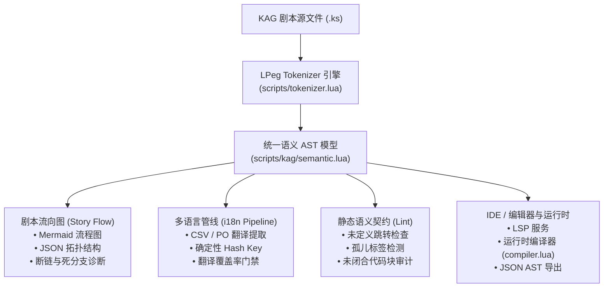
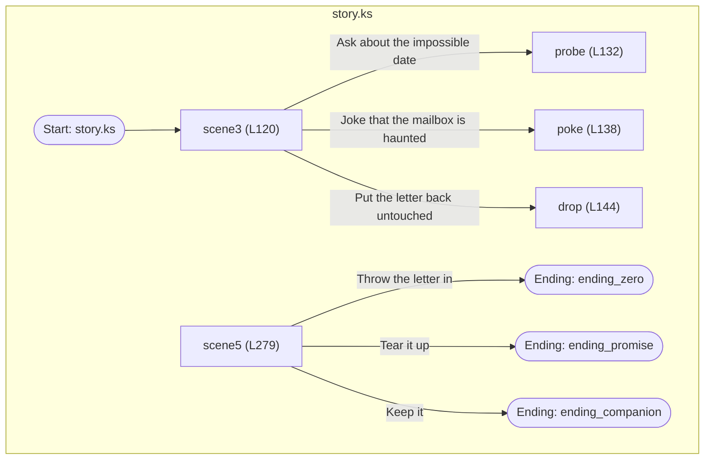
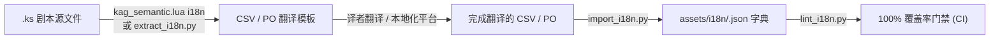

# Caesura (AmeKAG) — 创作者工具链与统一语义层指南

> 本指南介绍 Caesura 引擎为视觉小说创作者与工具开发者提供的自动化工具链与统一语义分析层：**统一 AST 语义层 (Unified Semantic Layer)**、**CLI 前端工具 (`kag_semantic.lua`)**、**剧本大纲可视化流向图 (Story Flow Graph)** 与 **自动化多语言本地化流水线 (i18n Pipeline)**。

---

## 1. 统一 AST 语义分析层 (Unified Semantic Layer)

### 1.1 设计理念与解析漂移消除

在传统视觉小说引擎的工具链中，剧本编辑器、大纲生成器、翻译提取器与运行时编译器往往各自编写独立的正则表达式或解析器。当语法扩展（如引入 KAG3 位置参数、内联代码块、复杂条件表达式）时，各工具容易产生“**解析漂移 (Semantic Drift)**”。

Caesura 通过 [`scripts/kag/semantic.lua`](file:///d:/%E6%96%87%E4%BB%B6%E5%AD%98%E6%94%BE%E5%A4%84/code/Caesura%28AmeKAG%29/scripts/kag/semantic.lua) 建立了**统一语义分析层**，确立单一解析真相源（Single Source of Truth）：
- **底层驱动**：基于 LPeg 高性能词法解析引擎 ([`scripts/tokenizer.lua`](file:///d:/%E6%96%87%E4%BB%B6%E5%AD%98%E6%94%BE%E5%A4%84/code/Caesura%28AmeKAG%29/scripts/tokenizer.lua))，完整支持 KAG 标准语法规范；
- **全链路共享**：Story Flow 拓扑分析、i18n 多语言提取、IDE/LSP 服务与编译器均消费同一份 AST 语义数据；
- **零运行时外部依赖**：纯 Lua 实现，跨平台无缝运行于 Windows、macOS 与 Linux。

### 1.2 架构拓扑 (Single Source of Truth)



### 1.3 统一语义模型数据结构

调用 [`semantic.parse()`](file:///d:/%E6%96%87%E4%BB%B6%E5%AD%98%E6%94%BE%E5%A4%84/code/Caesura%28AmeKAG%29/scripts/kag/semantic.lua) 输出的标准 AST 语义对象包含以下核心字段：

| 字段 | 类型 | 说明 |
|---|---|---|
| `file` / `basename` | `string` | 场景源文件完整路径与基准文件名 |
| `nodes` | `array` | 结构化 AST 节点列表（含精确 `line`, `col`, `offset`, `end_offset`） |
| `labels` | `table` | 跳转标签索引（`*name` -> `{ line, col, title, is_entry }`） |
| `jumps` | `array` | 跳转指令集合（`from`, `target`, `storage`, `condition`, `kind`） |
| `calls` | `array` | 子程序调用拓扑（`from`, `target`, `storage`, `line`） |
| `choices` | `array` | 玩家分支选项（`from`, `target`, `text`, `line`, `col`） |
| `endings` | `array` | 结局与终结点（`label`, `name`, `line`） |
| `translatables` | `array` | 可翻译字符串集合（对话、选项、通知，附带确定性哈希 Key） |
| `diagnostics` | `array` | 静态契约违规、未定义跳转目标、死分支告警与未闭合代码块 |
| `flow_graph` | `table` | 图论流向拓扑（节点 + 有向边，用于 Mermaid 与编辑器渲染） |

---

## 2. 统一语义 CLI 前端 (`scripts/kag_semantic.lua`)

[`scripts/kag_semantic.lua`](file:///d:/%E6%96%87%E4%BB%B6%E5%AD%98%E6%94%BE%E5%A4%84/code/Caesura%28AmeKAG%29/scripts/kag_semantic.lua) 是创作者工具链的统一命令行入口，支持直接操作单文件或批量扫描目录。

### 2.1 命令总览

```bash
# 语法
lua scripts/kag_semantic.lua <command> <input.ks|dir> [options]

# 子命令
# 1. flow   - 生成剧本大纲流向图与分支拓扑
# 2. i18n   - 从 AST 提取可翻译字符串 (CSV / PO)
# 3. json   - 导出结构化 AST / 语义模型 JSON
# 4. lint   - 运行静态语义契约与分支可达性审计
```

### 2.2 子命令详解

#### ① `flow` — 剧本大纲流向图与分支诊断
```bash
# 生成 Mermaid 流程图（默认输出到终端）
lua scripts/kag_semantic.lua flow demo/example_game/ --format mermaid

# 导出为 Markdown 文件
lua scripts/kag_semantic.lua flow demo/example_game/ --format mermaid -o docs/design/story_flow.md

# 导出为编辑器拓扑 JSON 数据
lua scripts/kag_semantic.lua flow demo/example_game/ --format json -o tmp/story_flow.json

# 启用分支静态诊断（检测断链跳转与孤儿标签）
lua scripts/kag_semantic.lua flow demo/example_game/ --lint
```

#### ② `i18n` — 提取多语言字符串
```bash
# 从 AST 提取并导出为 CSV 表格（适合 Excel / 译者编辑）
lua scripts/kag_semantic.lua i18n demo/example_game/ --format csv -o assets/i18n/template.csv

# 从 AST 提取并导出为 GNU gettext PO 模板（适合 Poedit / Crowdin）
lua scripts/kag_semantic.lua i18n demo/example_game/ --format po --lang zh -o assets/i18n/zh.po
```

#### ③ `json` (或 `ast`) — 导出 AST 语义模型
```bash
# 将单场景解析为标准 AST JSON
lua scripts/kag_semantic.lua json demo/example_game/story.ks -o tmp/story_ast.json
```

#### ④ `lint` — 静态契约与可达性检查
```bash
# 检查整个剧本目录的语法闭合性、跳转有效性与标签完整性
lua scripts/kag_semantic.lua lint demo/example_game/
```

---

## 3. 剧本大纲流向图 (Story Flow Graph)

### 3.1 工作原理
Story Flow 直接消费统一 AST 中的 `labels`、`jumps`、`calls`、`choices` 与 `endings`：
- **标签与结局节点**：自动识别 `*label` 与 `[ending]` 命令，标注行号与节点类型；
- **玩家选择边**：提取 `[select]` / `[sel]` / `[button]` 中的分支选项与指向的目标标签；
- **控制转移边**：解析 `[jump]`（虚线边）与 `[call]`（双线边），附带条件表达式（`[if ...]`）；
- **静态诊断**：实时验证所有跳转目标是否存在，提示未被任何指令引用的孤儿标签。

### 3.2 调用方式（Lua 原生 & Python 封装）

推荐使用 Lua 原生 CLI 工具，项目同时保留了 Python 封装脚本 [`scripts/generate_story_flow.py`](file:///d:/%E6%96%87%E4%BB%B6%E5%AD%98%E6%94%BE%E5%A4%84/code/Caesura%28AmeKAG%29/scripts/generate_story_flow.py) 以便无缝集成于现有 Python CI 脚本中：

```bash
# 方式 A：Lua 原生 CLI（推荐，零外部依赖）
lua scripts/kag_semantic.lua flow demo/example_game/ --lint -o docs/design/story_flow.md

# 方式 B：Python 包装器（内部调用 kag_semantic.lua 统一 AST）
python scripts/generate_story_flow.py demo/example_game/ --format mermaid --lint -o docs/design/story_flow.md
```

### 3.3 示例产物：Mermaid 流程图展示



---

## 4. 自动化多语言本地化流水线 (i18n Pipeline)

### 4.1 共享 AST 提取机制与确定性哈希

因为 i18n 提取器与 Story Flow 共享同一份 AST，所有的待翻译内容不仅涵盖对白，还与剧本作用域、标签、分支选项完全对齐：
1. **多命令全面覆盖**：自动提取 `[ch text="..."]`、`[text content="..."]`、`[sel text="..."]`、`[button text="..."]`、`[notify msg="..."]`、`[toast msg="..."]`、`[caption title="..."]`、`[dialog message="..."]` 及裸文本块；
2. **确定性 Key 生成**：采用 `<scene>:<scope>:<kind>:L<line>:<content_hash>` 命名规范（例如 `story.ks:scene3:ch:L125:a1b2c3`），即使多次提取或场景微调也能保证 Key 的绝对幂等性与一致性。

### 4.2 完整工作流生命周期



### 4.3 步骤详解

#### 步骤 1：提取翻译模板 (`scripts/kag_semantic.lua i18n` / `scripts/extract_i18n.py`)
```bash
# 导出为 CSV 表格（适合 Excel / 本地化协作表）
lua scripts/kag_semantic.lua i18n demo/example_game/ --format csv -o tmp/game_strings.csv

# 或者使用 Python 包装器
python scripts/extract_i18n.py demo/example_game/ --out tmp/game_strings.csv --format csv

# 导出为 GNU gettext PO 模板（适合 Poedit / Crowdin）
lua scripts/kag_semantic.lua i18n demo/example_game/ --format po --lang zh -o tmp/game_strings.po
```

导出的 CSV 结构示例：
```csv
Key,File,Line,Col,Speaker,Kind,SourceText,Translation_zh,Translation_en,Translation_ja
story.ks:scene3:ch:L125:8f2a1b,story.ks,125,1,Mio,ch,今天的天气真好。,今天的天气真好。,It is a nice day.,今日はいい天気ですね。
```

#### 步骤 2：编译与导入运行时字典 ([`scripts/import_i18n.py`](file:///d:/%E6%96%87%E4%BB%B6%E5%AD%98%E6%94%BE%E5%A4%84/code/Caesura%28AmeKAG%29/scripts/import_i18n.py))
将翻译完成的 CSV 或 PO 一键转换为引擎运行时所需的 JSON 字典：
```bash
# 从 CSV 编译出 assets/i18n/zh.json, en.json, ja.json
python scripts/import_i18n.py tmp/game_strings.csv --out-dir assets/i18n/

# 从单语言 PO 文件导入
python scripts/import_i18n.py tmp/game_strings_en.po --po-out assets/i18n/en.json
```

#### 步骤 3：翻译完整性审计与 CI 门禁 ([`scripts/lint_i18n.py`](file:///d:/%E6%96%87%E4%BB%B6%E5%AD%98%E6%94%BE%E5%A4%84/code/Caesura%28AmeKAG%29/scripts/lint_i18n.py))
自动对比所有语言版本的键覆盖率，防止漏翻、空行或缺失项进入发布版本：
```bash
python scripts/lint_i18n.py --dir assets/i18n/ --langs zh en ja
```

---

## 5. 游戏内多语言瞬时热切换 (`[i18n]`)

在 KAG 剧本中，创作者可以使用 `[i18n]` 命令在运行时瞬时切换语言，无需重新加载场景：

```kag
; 切换为中文
[i18n language=zh]
[ch name="Mio" text="这个示例游戏支持中英日多语言。"]
[p]

; 切换为英文
[i18n language=en]
[ch name="Mio" text="This sample game supports multilingual switching."]
[p]

; 切换为日文
[i18n language=ja]
[ch name="Mio" text="このサンプルゲームは多言語切り替えに対応しています。"]
[p]
```

---

## 6. 技术规格与参考索引

| 模块 / 文档 | 路径 | 说明 |
|---|---|---|
| **统一语义层架构设计** | [`docs/design/kag-unified-semantic-layer.md`](file:///d:/%E6%96%87%E4%BB%B6%E5%AD%98%E6%94%BE%E5%A4%84/code/Caesura%28AmeKAG%29/docs/design/kag-unified-semantic-layer.md) | 统一语义分析层架构拓扑与漂移消除说明 |
| **CLI 前端工具** | [`scripts/kag_semantic.lua`](file:///d:/%E6%96%87%E4%BB%B6%E5%AD%98%E6%94%BE%E5%A4%84/code/Caesura%28AmeKAG%29/scripts/kag_semantic.lua) | 统一 AST CLI 工具实现（flow / i18n / json / lint） |
| **语义分析核心模块** | [`scripts/kag/semantic.lua`](file:///d:/%E6%96%87%E4%BB%B6%E5%AD%98%E6%94%BE%E5%A4%84/code/Caesura%28AmeKAG%29/scripts/kag/semantic.lua) | AST 生成、拓扑提取、确定性 Hash 与导出器实现 |
| **单元测试套件** | [`tests/scripts/test_kag_semantic.lua`](file:///d:/%E6%96%87%E4%BB%B6%E5%AD%98%E6%94%BE%E5%A4%84/code/Caesura%28AmeKAG%29/tests/scripts/test_kag_semantic.lua) | 29 项单元测试，覆盖控制流、分支、i18n 与导出器 |
| **流向图生成脚本** | [`scripts/generate_story_flow.py`](file:///d:/%E6%96%87%E4%BB%B6%E5%AD%98%E6%94%BE%E5%A4%84/code/Caesura%28AmeKAG%29/scripts/generate_story_flow.py) | Python 包装器，委托至 `kag_semantic.lua flow` |
| **多语言提取脚本** | [`scripts/extract_i18n.py`](file:///d:/%E6%96%87%E4%BB%B6%E5%AD%98%E6%94%BE%E5%A4%84/code/Caesura%28AmeKAG%29/scripts/extract_i18n.py) | Python 包装器，委托至 `kag_semantic.lua i18n` |
| **多语言编译脚本** | [`scripts/import_i18n.py`](file:///d:/%E6%96%87%E4%BB%B6%E5%AD%98%E6%94%BE%E5%A4%84/code/Caesura%28AmeKAG%29/scripts/import_i18n.py) | 将 CSV / PO 转换为运行时 JSON 字典 |
| **多语言门禁脚本** | [`scripts/lint_i18n.py`](file:///d:/%E6%96%87%E4%BB%B6%E5%AD%98%E6%94%BE%E5%A4%84/code/Caesura%28AmeKAG%29/scripts/lint_i18n.py) | 校验各语言版本键覆盖率与缺译项 |
